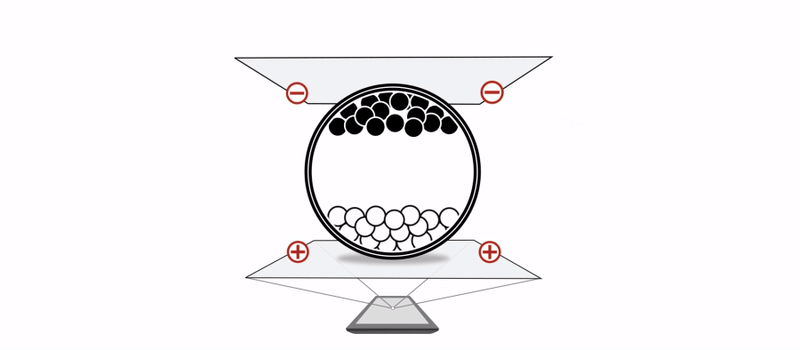
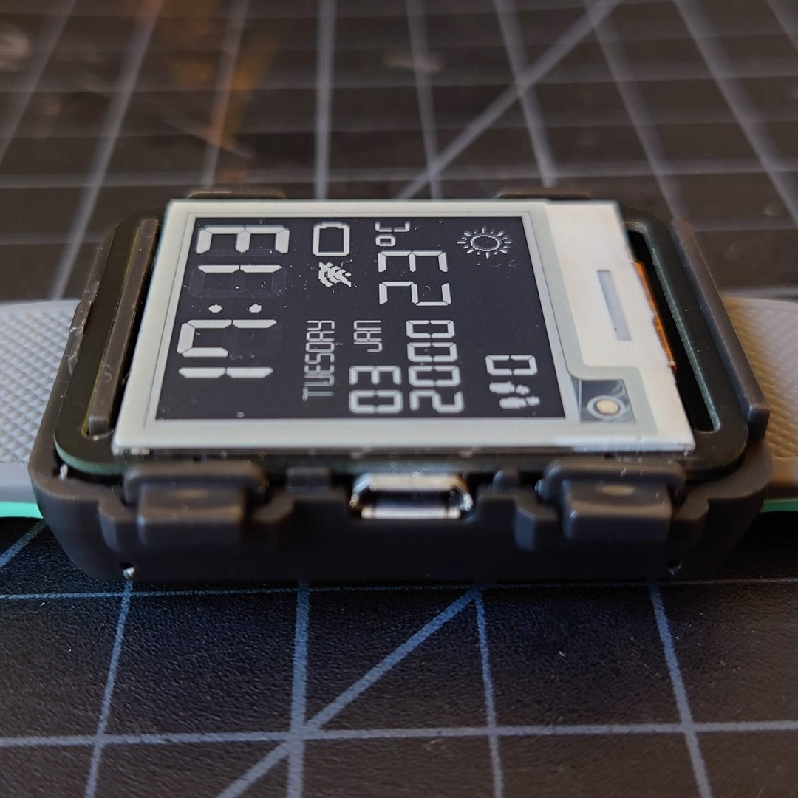

### Is the screen E-Ink/E-Paper/LCD/CRT?

E-Ink/E-Paper is the same technology used in devices like the Kindle. E-Ink is a **brand** of electronic paper (E-Paper) displays. Devices like the Pebble use a low power LCD, which **is not** E-Ink or E-Paper.

**Watchy is E-Paper**



### Which side is the front/back of the E-Ink display?

The front is the side that's whitish gray, with a white bezel at the bottom. The back is metallic and mirror-like.

### I need to realign/remove the screen, help!
- **Do Not Pry Off the Screen!** It is made of glass and prying it off the strong adhesive will crack it
- **Do Not Use A Heatgun To Melt The Adhesive!** Temperatures over 60C will damage the screen
- Check out this video on how to remove the screen using floss https://youtu.be/OjCd0NY1Yx0

### The case doesn't fit/close, how do I assemble it?

1. Make sure the battery cable is neatly tucked into the slot


2. Insert PCB and buttons into the bottom case. Make sure everything sits flush and nothing is popping out.



3. Put on the top case by first hooking the upper snap


4. Close down the case with minimal force, there should be a satisfying "click"


5. If the case is a bit loose and doesn't stay closed, put a small piece of tape inside the top snap.

### The Watchy PCB doesn't fit in my plastic/aluminum case

1. Check for burrs on the sides of the PCB, there may be two on each side, where the boards are cut apart during manufacturing. You can file down these protruding areas.
2. Check that the vibration motor is not sticking out, it should be sitting entirely on the PCB. You can lift it up lightly and stick it back on.

### How do I add a new watch face? What's the difference between watch face and firmware?

Currently, the watch face is the entire firmware. To change the watch face, you need to upload the watch face's firmware to your Watchy using either the Arduino IDE, or esptool.py

To build one of the example faces, start here: [Arduino Setup](/docs/getting-started#arduino-setup)

For information on making your own face, go here: [Create Your Own Watch Face](/docs/create-watchface)

### How do I change the weather to show Fahrenheit instead of Celsius?

Check out https://github.com/tapecanvas/WatchyDefaultFahrenheit

### I'm getting a ```Failed to execute script esptool``` error

This is a known issue for macOS 11 "Big Sur", see https://github.com/espressif/arduino-esp32/issues/4408 for solutions

### When compiling a watch face, I get a warning:
- **WARNING: library DS3232RTC claims to run on avr architecture(s) and may be incompatible with your current board which runs on esp32 architecture(s)**
    - You can safely ignore this warning.

### Why does my display appear "static-y" or ghosting?

- **Make sure you are using the latest version of the GxEDP2 library (i.e. > 1.2.16)** , there is a fix for the GDEH0154D67 display driver
- Ensure the FPC cable is fully inserted, and the lock is in place

### How do I apply the screen protector?

1. Make sure the screen is clean and free of dust and oils after peeling off the green tab film
2. Peel off the back film on the screen protector before attaching it to the screen. It may be easier to align it with the case assembled
3. The screen protector can be removed and re-applied if necessary. Simply peel it off and clean it with dish soap and let to dry
4. A drop of rubbing alcohol on the screen before applying the protector may also help squeeze out the bubbles

### I made a watch face and I want to share it on the gallery!

Check out these instructions [here](/docs/create-watchface#share-your-watch-face)

### I have another issue, could you help me out?

- Open an issue on our [Github](https://github.com/sqfmi/Watchy/issues), provide additional details on your setup (e.g. OS, Arduino Version, etc.) and photos of your Watchy
- Ping us on [Discord](https://discord.gg/ZXDegGV8E7)!

### I need a replacement screen/strap/case, where can I get one?

You may purchase replacement parts and accessories at https://shop.sqfmi.com

For screens, you may also get them on https://www.aliexpress.com/item/3256803841306234.html

### Which board revision is my Watchy?

- Select **About Watchy** in the menu to see the revision number
