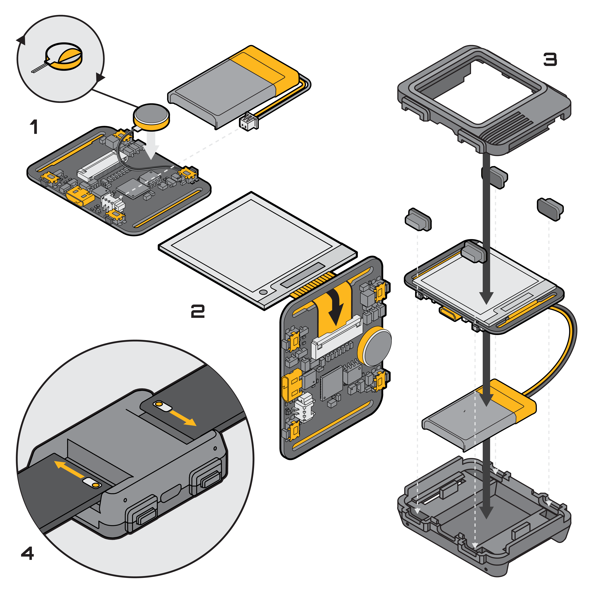
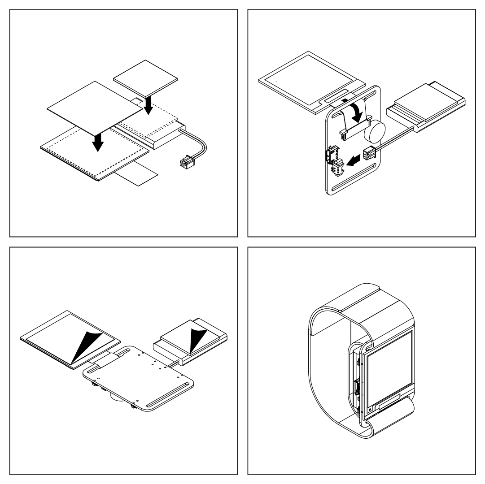

## Watchy Kit w/ Case Assembly


**Before You Begin** make sure you review the instructions and inspect for any missing or damaged components.

**Remove The Components Carefully** as they are tightly packed for maximum protection. The display is made of glass and will crack if you bend it!

**Test Your PCB** to make sure the board is functional before taping everything down! The tape is very strong and it will be impossible to re-align/remove anything once secured.

1. Connect the screen to the FPC connector, the shiny gold pins on the ribbon cable should be facing up
2. Connect the battery
3. Connect the USB to start charging the battery
4. Press [SW1](/docs/hardware#bill-of-materials) to bring up the **menu**/**confirm**
5. Press [SW3](/docs/hardware#bill-of-materials) & [SW4](/docs/hardware#bill-of-materials) to navigate **up**/**down**
6. Press [SW2](/docs/hardware#bill-of-materials) to **exit/cancel**
7. Wait 1 minute to check and see if the clock is updating the time correctly

**Tips**

- **Make sure the screen is perfectly aligned when taping it down!** It should not extend above or below the strap holes on the PCB.
- **Apply the screen protector AFTER assembling it in the case and note the orientation.** This will prevent misaligned screen and case
- **Do NOT force the case to close. It could break the buttons!** The case should close easily with a light snap. It's easier to anchor the top snap first, then close down to the bottom snap.
- **Do NOT overtighten the screws in the aluminum case** Overtightening will crack the screen! Make sure everything fits nicely and slowly adjust the screws to secure the case.

Assembly video: https://www.youtube.com/watch?v=ftLTrr_HTpI

## Watchy Original Assembly


1. Apply tape to the **back** of the E-Paper display and battery. The **front of the display is white** and the **back of the display is metallic/silver**
2. Pull lightly to unlock the FFC connector, insert the display cable through the strap hole. Make sure the cable is inserted all the way, then push the lock back in to secure the cable. 
3. Fold back and align the display to the top of the PCB, peel off tape and firmly secure the display
4. Insert battery plug, ensure correct polarity (red is closer to the USB connector)
5. Peel off tape and firmly secure battery to the PCB
6. Insert watch strap through PCB strap holes, then tighten strap from both ends
7. Wrap strap around arm and adjust for comfort

Assembly video: https://www.youtube.com/watch?v=PCPxTS1aF3w

## Arduino Setup

Watchy comes pre-loaded with firmware that demonstrates all the basic features. You can also try different watch faces and examples in Arduino.

1. Download and install the latest <ins>[Arduino IDE](https://www.arduino.cc/en/software)</ins>
2. Start Arduino and open the *Preferences* window.
3. Under *Additional Board Manager URLs* add:

    ```
    https://raw.githubusercontent.com/espressif/arduino-esp32/gh-pages/package_esp32_index.json
    ```
4. Open **Boards Manager** under Tools > Board menu and install the *esp32* platform
5. Under Sketch > Include Library > Manage Libraries, search for **Watchy** and install the latest version
6. Make sure all the depedencies are updated to the latest version i.e. **GxEPD2** , **WiFiManager**, **etc.**

---

## Upload

1. Plug in USB on Watchy and select the serial port that shows up
2. If nothing shows up, or if you're having trouble uploading, make sure you have the <ins>[USB-Serial drivers](https://www.silabs.com/products/development-tools/software/usb-to-uart-bridge-vcp-drivers)</ins> installed.
2. Select **ESP32 Dev Module** under Tools > Board > ESP32 Arduino
3. Select **Minimal SPIFFS** under Tools > Partition Scheme  
    Note: there are two options called **Minimal**, make sure you pick the one with **SPIFFS** in the name
4. Leave everything else as default
6. Choose an example and hit upload
7. Try modifiying the examples or create your own app!